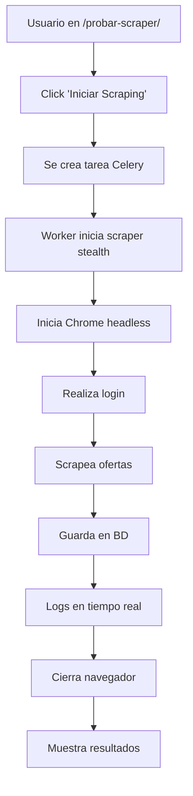

# 🌐 Guía: Usar la Página de Scraper

## 📍 URL

```
http://localhost:8000/matching/probar-scraper/
```

---

## ✅ Cambios Aplicados

La página de scraper ahora usa el **nuevo scraper STEALTH** que incluye:

- ✅ Bypass de Cloudflare automático
- ✅ undetected-chromedriver
- ✅ Login automático con credenciales del usuario
- ✅ Extracción de ofertas
- ✅ Guardado automático en base de datos
- ✅ Logs en tiempo real

---

## 🚀 Cómo Usar

### **Paso 1: Configurar Credenciales**

Antes de usar el scraper, debes configurar tus credenciales de DV Carreras:

1. Ve a **Perfil**: http://localhost:8000/accounts/profile/
2. En la sección **"Credenciales DV Carreras"**, ingresa:
   - **Usuario DV**: Tu DNI (ej: 19138087)
   - **Contraseña DV**: Tu contraseña de dvcarreras
3. Haz clic en **"Probar Conexión DV"**
4. Espera a que se verifique la conexión (puede tardar 30-60 segundos)

### **Paso 2: Ir a la Página del Scraper**

1. Navega a: http://localhost:8000/matching/probar-scraper/
2. Verás una interfaz con:
   - Botón **"Iniciar Scraping"**
   - Área de logs en tiempo real
   - Estadísticas de ofertas encontradas

### **Paso 3: Iniciar Scraping**

1. Haz clic en **"Iniciar Scraping"**
2. Verás un mensaje: *"Scraping con STEALTH iniciado (bypass Cloudflare). Task ID: xxxxx"*
3. Los logs aparecerán en tiempo real mostrando el progreso

### **Paso 4: Ver Resultados**

Durante el scraping verás logs como:

```
[DVCarrerasStealth] Iniciando navegador stealth...
[DVCarrerasStealth] Navegador stealth iniciado correctamente
[DVCarrerasStealth] Realizando login...
[DVCarrerasStealth] Login exitoso detectado
[DVCarrerasStealth] Sesión guardada con 2 cookies
[DVCarrerasStealth] Iniciando scraping del tablero de ofertas...
[DVCarrerasStealth] Encontradas 9 filas en el tablero
[DVCarrerasStealth] Scraping completado: 9 ofertas encontradas
```

Al finalizar, las ofertas se guardan automáticamente en la base de datos.

---

## 📊 Ver Ofertas Scrapeadas

### **Opción 1: Desde el Admin de Django**

1. Ve a: http://localhost:8000/admin/
2. Inicia sesión con tu cuenta de administrador
3. Ve a **Matching → Ofertas de Trabajo**
4. Filtra por **Source: dvcarreras_stealth**

### **Opción 2: Vista de Resultados**

1. Ve a: http://localhost:8000/matching/scraping-results/
2. Verás las estadísticas y ofertas encontradas

### **Opción 3: Usando el Shell**

```bash
docker exec postulamatic-worker-1 python manage.py shell -c "
from matching.models import JobPosting
jobs = JobPosting.objects.filter(source='dvcarreras_stealth')
print(f'Total: {jobs.count()} ofertas')
for j in jobs:
    print(f'- {j.title} ({j.email})')
"
```

---

## 🔍 Monitoreo en Tiempo Real

### **Logs en la Página**

Los logs se actualizan automáticamente cada 2 segundos mientras el scraping está activo.

Puedes ver:
- ✅ Inicio del navegador
- ✅ Progreso del login
- ✅ Sesiones guardadas
- ✅ Número de ofertas encontradas
- ✅ Estado de guardado en BD
- ✅ Cierre del navegador

### **Logs en el Contenedor**

```bash
# Ver logs del worker
docker logs postulamatic-worker-1 -f

# Filtrar solo logs del scraper stealth
docker logs postulamatic-worker-1 -f 2>&1 | grep DVCarrerasStealth
```

---

## 🛠️ Solución de Problemas

### **Problema: "Debes configurar las credenciales de dvcarreras primero"**

**Solución:**
1. Ve a: http://localhost:8000/accounts/profile/
2. Configura tus credenciales DV
3. Prueba la conexión
4. Vuelve a intentar el scraping

---

### **Problema: "Ya hay un scraping activo"**

**Solución:**

Espera a que el scraping actual termine (60-90 segundos) o cancélalo:

```bash
# Ver tareas activas
docker exec postulamatic-worker-1 celery -A postulamatic inspect active

# Cancelar todas las tareas (si es necesario)
docker exec postulamatic-worker-1 celery -A postulamatic purge
```

---

### **Problema: Logs no se actualizan**

**Solución:**

1. Verifica que el worker esté corriendo:
   ```bash
   docker ps | grep worker
   ```

2. Reinicia el worker si es necesario:
   ```bash
   docker restart postulamatic-worker-1
   ```

3. Verifica los logs del worker:
   ```bash
   docker logs postulamatic-worker-1 --tail 50
   ```

---

### **Problema: "Error iniciando scraping"**

**Solución:**

1. Verifica que Chrome esté instalado:
   ```bash
   docker exec postulamatic-worker-1 google-chrome --version
   ```

2. Verifica las dependencias:
   ```bash
   docker exec postulamatic-worker-1 python -c "import undetected_chromedriver; print('OK')"
   ```

3. Si falla, reconstruye el worker:
   ```bash
   docker-compose build worker
   docker-compose up -d worker
   ```

---

## 📈 Flujo Completo



---

## 🎯 Características de la Página

### **Interfaz**

- ✅ Botón de inicio de scraping
- ✅ Área de logs en tiempo real
- ✅ Indicador de progreso
- ✅ Estadísticas de ofertas
- ✅ Estado de la tarea

### **Funcionalidad**

- ✅ Detección de tareas activas (evita duplicados)
- ✅ Logs en tiempo real vía AJAX
- ✅ Guardado automático en BD
- ✅ Manejo de errores
- ✅ Mensajes de éxito/error

### **Backend**

- ✅ Tarea Celery asíncrona
- ✅ Bypass de Cloudflare con undetected-chromedriver
- ✅ Gestión de sesiones (cookies)
- ✅ Logs estructurados en BD
- ✅ Reintentos automáticos (hasta 3)

---

## 📋 Ejemplos de Uso

### **Ejemplo 1: Scraping Manual**

1. Ve a http://localhost:8000/matching/probar-scraper/
2. Click en **"Iniciar Scraping"**
3. Espera 60-90 segundos
4. Verás: *"Scraping completado: 9 ofertas encontradas"*
5. Las ofertas están en la BD

### **Ejemplo 2: Verificar Ofertas**

```bash
docker exec postulamatic-worker-1 python manage.py shell -c "
from matching.models import JobPosting
print(JobPosting.objects.filter(source='dvcarreras_stealth').count())
"
```

### **Ejemplo 3: Ver Última Oferta**

```bash
docker exec postulamatic-worker-1 python manage.py shell -c "
from matching.models import JobPosting
latest = JobPosting.objects.filter(source='dvcarreras_stealth').latest('created_at')
print(f'Título: {latest.title}')
print(f'Email: {latest.email}')
print(f'Fecha: {latest.created_at}')
"
```

---

## ✅ Checklist de Verificación

Antes de usar la página, verifica:

- [ ] Contenedores corriendo (`docker ps`)
- [ ] Chrome instalado en worker
- [ ] Credenciales DV configuradas en perfil
- [ ] Conexión DV verificada
- [ ] Worker accesible
- [ ] Redis corriendo

---

## 🔗 Enlaces Útiles

- **Página del scraper:** http://localhost:8000/matching/probar-scraper/
- **Perfil (configurar credenciales):** http://localhost:8000/accounts/profile/
- **Resultados:** http://localhost:8000/matching/scraping-results/
- **Admin:** http://localhost:8000/admin/

---

## 📞 Soporte

Si tienes problemas:

1. Revisa esta guía
2. Verifica los logs: `docker logs postulamatic-worker-1 --tail 100`
3. Consulta `VERIFICAR_SCRAPER_STEALTH.md`
4. Consulta `RESULTADO_VERIFICACION.md`

---

**¡Listo!** Ahora puedes usar la página de scraper con el nuevo sistema STEALTH que bypasea Cloudflare automáticamente. 🚀

