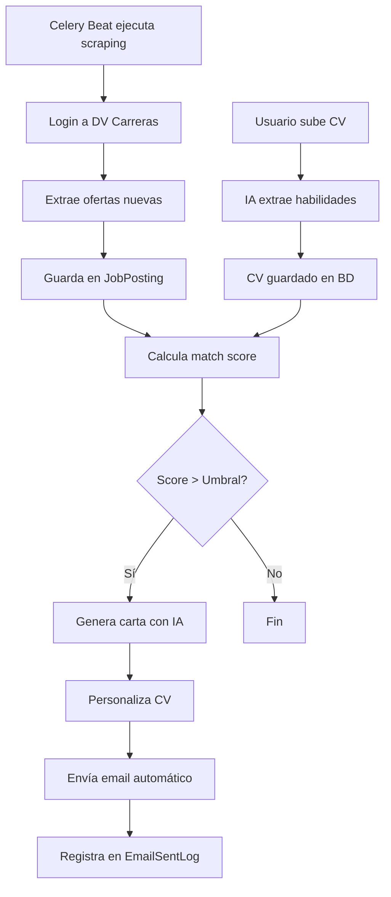

# 🚀 PostulaMatic

> Sistema inteligente de postulación automática a ofertas laborales con IA


**PostulaMatic** es una plataforma que automatiza el proceso de postulación a empleos, desde la detección de ofertas hasta el envío personalizado de CVs y cartas de presentación generadas con inteligencia artificial.

🌐 **Demo en vivo:** [postulamatic.app](https://postulamatic.app)

---

## 📋 Tabla de Contenidos

- [Características](#-características-principales)
- [Cómo Funciona](#-cómo-funciona)
- [Tecnologías](#️-stack-tecnológico)
- [Arquitectura](#️-arquitectura)
- [Base de Datos](#️-base-de-datos)
- [Instalación](#-instalación)
- [Uso](#-uso)
- [Deployment](#-deployment)
- [Documentación](#-documentación)
- [Contribuir](#-contribuir)
- [Licencia](#-licencia)

---

## ✨ Características Principales

### 🤖 **Automatización Inteligente**
- ✅ **Scraping stealth** de portales de empleo (Da Vinci Carreras)
- ✅ **Extracción de habilidades** del CV con IA (OpenAI/Anthropic)
- ✅ **Matching automático** CV ↔ Puesto con score 0-100
- ✅ **Envío automático** cuando el match supera el umbral configurado

### 📝 **IA Generativa**
- ✅ **Cartas de presentación personalizadas** con GPT/Claude
- ✅ **Múltiples estilos**: Base, Formal, Creativo, Técnico
- ✅ **Personalización de CVs** para cada oferta
- ✅ **Fallback automático** entre proveedores de IA

### 📧 **Gestión de Emails**
- ✅ **SMTP personalizado** por usuario
- ✅ **Rate limiting** configurable (pausas aleatorias)
- ✅ **Límite diario** de envíos
- ✅ **Dashboard de seguimiento** con estadísticas

### 🔐 **Seguridad y Privacidad**
- ✅ **Encriptación Fernet** de credenciales
- ✅ **OAuth con Google** (django-allauth)
- ✅ **Restricción de dominios** (@davinci.edu.ar)
- ✅ **HTTPS con Let's Encrypt**

### 📊 **Dashboard y Monitoreo**
- ✅ **Vista en tiempo real** del scraping (con screenshots)
- ✅ **Logs persistentes** en base de datos
- ✅ **Estadísticas** de matches y envíos
- ✅ **Control granular** de automatización

---

## 🎯 Cómo Funciona



### **Flujo Detallado:**

1. **📄 Subida de CV**
   - Usuario sube PDF/DOCX
   - Parser extrae texto limpio
   - IA detecta habilidades y las categoriza
   - Se guarda en `UserCV` con skills normalizadas

2. **🕷️ Scraping Automático**
   - Celery Beat activa tarea programada (ej: 09:00 AM)
   - Worker ejecuta scraping stealth con `undetected-chromedriver`
   - Login a dvcarreras.davinci.edu.ar con credenciales del usuario
   - Extrae ofertas de la bolsa de trabajo
   - Decodifica emails ofuscados por Cloudflare
   - Guarda ofertas nuevas en `JobPosting`

3. **🎯 Matching Inteligente**
   - Para cada oferta nueva, compara habilidades
   - Calcula score usando keywords + análisis semántico con IA
   - Guarda en `MatchScore` (0-100)
   - Si score > umbral (configurable, default 70%):

4. **🤖 Generación con IA**
   - Genera carta de presentación personalizada (OpenAI/Anthropic)
   - Adapta el CV para destacar skills relevantes al puesto
   - Crea PDF personalizado

5. **📧 Envío Automático**
   - Envía desde cuenta SMTP del usuario
   - Adjunta CV personalizado
   - Pausa aleatoria entre envíos (anti-spam)
   - Registra todo en `EmailSentLog`

---

## 🛠️ Stack Tecnológico

### **Backend**
| Tecnología | Versión | Propósito |
|-----------|---------|-----------|
| **Python** | 3.12 | Lenguaje principal |
| **Django** | 5.2.6 | Framework web |
| **Gunicorn** | 22.0.0 | Servidor WSGI |
| **Celery** | Latest | Tareas asíncronas |
| **Redis** | 7-alpine | Cache + Message Broker |

### **Inteligencia Artificial**
- **OpenAI GPT-3.5/4** - Generación de texto, análisis de CVs
- **Anthropic Claude 3** - Fallback y análisis alternativo
- **spaCy** - NLP para extracción de habilidades

### **Web Scraping**
- **Selenium + undetected-chromedriver** - Scraping stealth
- **BeautifulSoup4** - Parsing HTML
- **FlareSolverr** - Bypass Cloudflare Turnstile

### **Procesamiento de Documentos**
- **PyPDF2 + PyMuPDF** - Extracción de PDFs
- **python-docx** - Parsing de Word
- **ReportLab** - Generación de PDFs
- **Pillow** - Procesamiento de imágenes

### **Infraestructura**
- **Docker + Docker Compose** - Contenedorización
- **Nginx** - Reverse proxy + TLS
- **Let's Encrypt** - Certificados SSL gratuitos
- **GitHub Actions** - CI/CD automático

---

## 🏗️ Arquitectura

### **Patrón: Monolito Modular con Microservicios Auxiliares**

```
┌─────────────────────────────────────────────────────┐
│              NGINX Reverse Proxy                     │
│         (TLS/SSL con Let's Encrypt)                  │
└────────────────┬────────────────────────────────────┘
                 │ HTTPS
                 ↓
┌─────────────────────────────────────────────────────┐
│          Django 5.2 + Gunicorn                       │
│  ┌──────────┬──────────┬──────────┬──────────┐      │
│  │ Landing  │ Matching │   Core   │  Admin   │      │
│  │  (App)   │  (App)   │ (Celery) │ (Django) │      │
│  └──────────┴──────────┴──────────┴──────────┘      │
└────┬────────────────────────────────────────────────┘
     │
     ├─→ Redis (Cache + Broker)
     ├─→ SQLite (Desarrollo) / PostgreSQL (Futuro)
     ├─→ Celery Workers (Tareas Asíncronas)
     ├─→ Celery Beat (Tareas Programadas)
     └─→ FlareSolverr (Bypass Cloudflare)
```

### **Estructura de Apps Django**

```
postulamatic/
├── core/               # Configuración de Celery
├── landing/            # Landing page pública
└── matching/           # App principal (95% de la lógica)
    ├── clients/        # Scrapers (stealth, playwright)
    ├── services/       # Lógica de negocio
    │   ├── ai_service.py
    │   ├── cv_parser.py
    │   ├── cv_personalizer.py
    │   ├── email_generator.py
    │   ├── ats_matcher.py
    │   ├── skills_extractor.py
    │   └── scraping_lock.py
    ├── tasks_*.py      # Tareas Celery
    ├── views_*.py      # Vistas por funcionalidad
    └── models.py       # Modelos de datos
```

---

## 🗄️ Base de Datos

### **Motor:** SQLite3 (desarrollo) → PostgreSQL (producción recomendada)

### **Modelos Principales:**

```python
# Perfil del usuario con credenciales encriptadas
UserProfile
├── smtp_host, smtp_port, smtp_username, smtp_password 🔐
├── dv_username, dv_password 🔐
├── match_threshold (0-100)
├── daily_limit, min_pause_seconds, max_pause_seconds
└── auto_send_enabled, auto_send_time

# CV con habilidades extraídas por IA
UserCV
├── original_file (FileField)
├── parsed_text
└── skills (JSONField: {"skills": [...], "categories": {...}})

# Ofertas scrapeadas
JobPosting
├── external_id (unique)
├── title, description, email
├── source (dvcarreras)
└── created_at

# Score de coincidencia
MatchScore
├── user, cv, job_posting (FKs)
├── score (0-100)
└── details (JSONField: explicación detallada)

# Log de emails enviados
EmailSentLog
├── user, cv, job_posting (FKs)
├── email_subject, email_body
├── personalized_cv_file (FileField)
├── status (sent/failed/queued/retry)
├── email_template (base/formal/creative/technical)
└── ai_provider (openai/anthropic/fallback)

# Configuración global de IA (Singleton)
AIConfiguration
├── openai_api_key 🔐, openai_model, openai_enabled
├── anthropic_api_key 🔐, anthropic_model, anthropic_enabled
└── default_provider

# Logs de scraping persistentes
ScrapingLog
├── user, task_id (Celery)
├── message, log_type (info/success/error/warning)
└── timestamp
```

**🔐 Seguridad:**
- Todas las contraseñas y API keys se encriptan con **Fernet (Cryptography)**
- Clave maestra en variable de entorno `ENCRYPTION_KEY`

---

## 📦 Instalación

### **Prerrequisitos**
- Python 3.12+
- Docker & Docker Compose
- Git

### **1. Clonar el repositorio**
```bash
git clone https://github.com/idgleb/PostulaMatic.git
cd PostulaMatic
```

### **2. Configurar variables de entorno**
```bash
cp .env.example .env
nano .env
```

Variables mínimas requeridas:
```env
SECRET_KEY=tu-django-secret-key-aqui
DEBUG=True
ENCRYPTION_KEY=tu-fernet-key-base64-aqui
OPENAI_API_KEY=sk-...
ANTHROPIC_API_KEY=sk-ant-...
```

### **3. Construir e iniciar contenedores**
```bash
# Crear red externa
docker network create web

# Construir imagen
docker-compose build

# Ejecutar migraciones
docker-compose run --rm postulamatic_web python manage.py migrate

# Crear superusuario
docker-compose run --rm postulamatic_web python manage.py createsuperuser

# Iniciar servicios
docker-compose up -d
```

### **4. Acceder a la aplicación**
- **Frontend:** http://localhost:8000
- **Admin:** http://localhost:8000/admin/
- **Dashboard:** http://localhost:8000/matching/

---

## 🚀 Uso

### **1. Configurar tu perfil**
1. Login en la plataforma
2. Ve a **Perfil** y configura:
   - **Credenciales SMTP** (Gmail, Outlook, etc.)
   - **Credenciales DV Carreras** (usuario y contraseña)
   - **Umbral de matching** (ej: 70%)
   - **Límite diario** de envíos

### **2. Subir tu CV**
1. Ve a **Mis CVs**
2. Sube tu CV en PDF o DOCX
3. Espera a que la IA extraiga tus habilidades
4. Revisa las skills detectadas

### **3. Iniciar Scraping Manual**
1. Ve a **Probar Scraper**
2. Haz clic en "Iniciar Scraping"
3. Observa el proceso en tiempo real (logs + screenshots)

### **4. Configurar Scraping Automático**
1. Ve a **Dashboard**
2. Configura hora del scraping diario (ej: 09:00)
3. Activa el switch "Scraping Automático"

### **5. Activar Envío Automático**
1. En **Perfil**, activa "Envío Automático Diario"
2. Configura la hora de envío
3. El sistema enviará emails a nuevos matches automáticamente

### **6. Monitorear Dashboard**
- **Ofertas encontradas**: Total de puestos scrapeados
- **Matches generados**: Coincidencias calculadas
- **Emails enviados**: Postulaciones enviadas
- **Tasa de éxito**: Porcentaje de envíos exitosos

---

## 🌐 Deployment

### **Producción con Docker**

El proyecto incluye CI/CD automático con **GitHub Actions**:

1. **Push a `master`** activa el pipeline
2. **Tests** (Black, isort, Ruff)
3. **Deploy automático** al servidor vía SSH
4. **Restart** de contenedores Docker

**Servidor de producción:**
- **OS:** Ubuntu Server
- **Reverse Proxy:** Nginx
- **TLS:** Let's Encrypt (renovación automática)
- **Dominio:** postulamatic.app

**Ver documentación completa:** [docs/SERVER_ARCHITECTURE.md](docs/SERVER_ARCHITECTURE.md)

---

## 📚 Documentación

### **Guías Técnicas**
- [Arquitectura del Servidor](docs/SERVER_ARCHITECTURE.md)
- [Sistema de Emails](docs/EMAIL_SYSTEM_QUICKSTART.md)
- [Configuración de IA](docs/CONFIGURACION_IA.md)
- [Scraping Stealth](docs/STEALTH_SCRAPER_QUICKSTART.md)
- [Personalización de CVs](docs/EMAIL_PERSONALIZATION_SERVICE.md)

### **Guías de Troubleshooting**
- [Prevención de Disco Lleno](docs/GUIA_PREVENCION_DISCO_LLENO.md)
- [Verificar Logs del Servidor](docs/VERIFICAR_LOGS_SERVIDOR.md)
- [Comandos SSH Útiles](docs/COMANDOS_SSH_SERVIDOR.md)

### **PRD y Diseño**
- [Product Requirements Document](docs/01-PRD-PostulaMatic.md)
- [Diagramas del Sistema](docs/EMAIL_SYSTEM_DIAGRAMS.md)

---

## 🛡️ Seguridad y Privacidad

### **Medidas Implementadas**
- ✅ **Encriptación** de todas las credenciales con Fernet
- ✅ **HTTPS obligatorio** con HSTS
- ✅ **Validación de dominios** para registro
- ✅ **Rate limiting** para prevenir abuse
- ✅ **CSRF protection** en todos los formularios
- ✅ **Secretos en variables de entorno** (nunca en código)

### **Cumplimiento**
- ✅ **Respeto a TOS** de sitios scrapeados
- ✅ **Consentimiento explícito** del usuario para automatización
- ✅ **Uso de credenciales propias** del usuario (no compartidas)

---

## 🐛 Características Anti-Detección

El scraper implementa múltiples técnicas stealth:

- **undetected-chromedriver** - Evita detección de automatización
- **User-Agent personalizado** - Emula navegador real
- **Delays aleatorios (jitter)** - Imita comportamiento humano
- **Gestión de sesiones** - Reutiliza cookies válidas
- **Screenshots automáticos** - Para debugging visual
- **Bypass de Cloudflare** - Con FlareSolverr

---

## 🤝 Contribuir

¡Las contribuciones son bienvenidas! Por favor:

1. **Fork** el repositorio
2. Crea una **rama feature** (`git checkout -b feature/AmazingFeature`)
3. **Commit** tus cambios (`git commit -m 'Add some AmazingFeature'`)
4. **Push** a la rama (`git push origin feature/AmazingFeature`)
5. Abre un **Pull Request**

### **Estándares de Código**
- **Formateo:** Black (line-length 88)
- **Imports:** isort (compatible con Black)
- **Linting:** Ruff
- **Tests:** Incluir tests para nueva funcionalidad

---

## 📝 Roadmap

### **v1.1 (Q1 2025)**
- [ ] Migración a PostgreSQL
- [ ] Soporte multi-portal (LinkedIn, Indeed)
- [ ] API REST pública

### **v1.2 (Q2 2025)**
- [ ] Dashboard con métricas avanzadas (Grafana)
- [ ] Notificaciones push/Telegram
- [ ] Análisis de feedback de empresas

### **v2.0 (Q3 2025)**
- [ ] Mobile app (React Native)
- [ ] Sistema de recomendación con ML
- [ ] Marketplace de templates de CV

---

## 📄 Licencia

Este proyecto está bajo la licencia **MIT**. Ver [LICENSE](LICENSE) para más detalles.

---

## 👨‍💻 Autor

**Gleb** - [GitHub](https://github.com/idgleb)

---

## 🙏 Agradecimientos

- **OpenAI** y **Anthropic** por las APIs de IA
- **undetected-chromedriver** por el scraping stealth
- **Django** y **Celery** por el framework robusto
- **Da Vinci Escuela de Arte y Diseño Multimedial** por el portal de carreras

---

## 📞 Soporte

- **Issues:** [GitHub Issues](https://github.com/idgleb/PostulaMatic/issues)
- **Email:** idgleb646807@gmail.com
- **Documentación:** [docs/](docs/)

---

<div align="center">

**⭐ Si este proyecto te ayudó, dale una estrella en GitHub! ⭐**

[🌐 Demo en Vivo](https://postulamatic.app) • [📚 Documentación](docs/) • [🐛 Reportar Bug](https://github.com/idgleb/PostulaMatic/issues)

</div>

